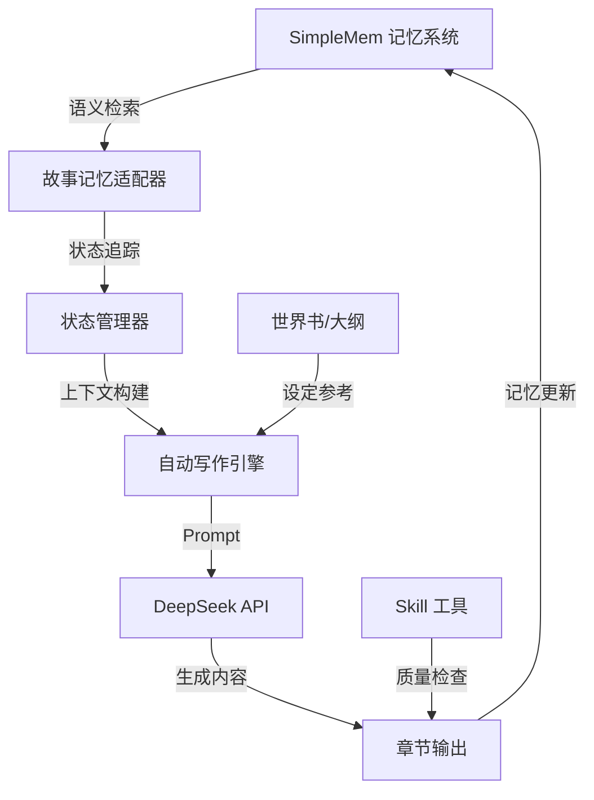
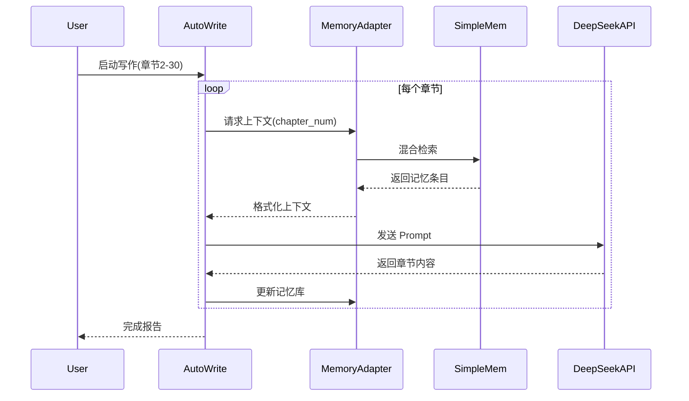

# 小说创作智能写作系统

<div align="center">

[**中文**] | [English](README_EN.md)

一个基于 **SimpleMem 记忆系统** 和 **DeepSeek API** 的智能小说创作辅助工具

[](https://www.python.org/downloads/)
[](LICENSE)
[](https://github.com/aiming-lab/SimpleMem)

</div>

---

## 🌟 核心特性

- **🧠 长期记忆管理**：基于 SimpleMem 的三阶段语义压缩流程，高效管理小说世界观、人物、情节
- **🔍 智能上下文检索**：混合检索（语义+关键词+结构化），精准定位相关记忆
- **✍️ 自动化写作**：DeepSeek API 驱动，支持章纲生成、内容创作、质量检查
- **📚 批量处理**：支持一次性处理多个章节，顺序/并行两种模式
- **🛠️ Skill 工具集成**：一致性检查、风格检测、大纲管理等专业工具
- **⚡ 高性能**：GPU 加速嵌入，并行处理，单章生成 ~40 秒

---

## 🎯 适用场景

- **网络小说创作**：长篇连载，需要管理复杂世界观和人物关系
- **剧本写作**：多线叙事，需要追踪时间线和角色状态
- **游戏文案**：大量设定和分支剧情
- **学术写作**：长篇论文，需要引用和回溯大量文献

---

## 📦 快速开始

### 环境要求

- Python 3.10+
- NVIDIA GPU（推荐，用于加速嵌入模型）
- DeepSeek API Key（或其他 OpenAI 兼容 API）

### 安装步骤

```bash
# 1. 克隆仓库
git clone https://github.com/YOUR_USERNAME/novel-writing-system.git
cd novel-writing-system

# 2. 安装 SimpleMem 依赖
cd SimpleMem
pip install -r requirements.txt

# 3. 配置 API
cp config.py.example config.py
# 编辑 config.py，填入你的 API Key

# 4. 测试 SimpleMem
python main.py
```

### 5 分钟上手

```python
from story_memory_adapter import StoryMemoryAdapter

# 初始化记忆系统
adapter = StoryMemoryAdapter(clear_db=True)

# 添加章节内容到记忆库
adapter.add_chapter(
    chapter_num=1,
    content="艾伦站在破旧的城堡中...",
    title="异世界醒来"
)

# 查询记忆
result = adapter.query_context("艾伦在做什么？")
print(result)

# 为写作生成上下文
context = adapter.get_writing_context(
    chapter_num=2,
    topics=["领地建设", "角色关系"]
)
```

---

## 🏗️ 系统架构



### 核心组件

| 组件 | 功能 | 技术栈 |
|------|------|--------|
| **SimpleMem** | 长期记忆管理 | LanceDB + Qwen3 Embedding |
| **StoryMemoryAdapter** | 小说记忆适配 | 分段提取 + 混合检索 |
| **StoryStateManager** | 状态追踪 | 角色状态 + 时间线管理 |
| **AutoWrite** | 自动化写作 | DeepSeek Chat API |
| **Skills** | 专业工具集 | 一致性检查 + 风格分析 |

---

## 💡 核心功能演示

### 1. 记忆检索

```python
# 查询角色历史
char_history = adapter.get_character_history("艾伦")

# 查询时间线事件
timeline = adapter.get_timeline_events(start_chapter=1, end_chapter=30)

# 直接问答
answer = adapter.ask_story("艾伦的修炼境界是什么？")
```

### 2. 批量写作

```python
from auto_write import run_auto_write

# 自动写作第 2-30 章
run_auto_write(start_chapter=2, end_chapter=30)
```

**流程图**：



### 3. 记忆→Prompt→API 完整示例

详见 [`example_memory_to_api.py`](projects/western-fantasy/example_memory_to_api.py)

---

## 📖 项目结构

```
novel-writing-system/
├── SimpleMem/                    # SimpleMem 核心系统
│   ├── main.py                   # 主入口
│   ├── config.py.example         # 配置模板
│   ├── core/                     # 核心模块（构建器+检索器）
│   ├── database/                 # 向量数据库
│   └── utils/                    # 工具类（LLM+嵌入）
│
├── projects/western-fantasy/     # 示例项目：西幻小说
│   ├── auto_write.py             # 自动写作脚本
│   ├── story_memory_adapter.py   # 记忆适配器
│   ├── example_memory_to_api.py  # 完整示例
│   ├── outline/                  # 大纲（卷/篇/章）
│   ├── worldbook/                # 世界书设定
│   └── docs/                     # 项目文档
│
└── skills/                       # Skill 工具集
    ├── mega-novel-orchestrator/  # 编排器
    ├── consistency-checker/      # 一致性检查
    └── style-detector/           # 风格检测
```

---

## 🔧 配置说明

### SimpleMem 配置

```python
# SimpleMem/config.py
OPENAI_API_KEY = "sk-xxx"                # API 密钥
OPENAI_BASE_URL = "https://api.deepseek.com"
LLM_MODEL = "deepseek-chat"
EMBEDDING_MODEL = "qwen3-4b"             # 本地嵌入模型
EMBEDDING_DEVICE = "cuda"                # GPU 加速
ENABLE_PARALLEL_PROCESSING = True       # 并行处理
MAX_PARALLEL_WORKERS = 4
```

### 项目配置

```yaml
# projects/western-fantasy/config.yaml
project_name: "western-fantasy"
genre: "western-fantasy-farming"

api:
  provider: "deepseek"
  model: "deepseek-chat"

writing:
  default_chapter_length: 5000
  temperature: 0.85
```

---

## 📊 性能指标

| 指标 | 数值 |
|------|------|
| 单章记忆提取 | ~5 秒 |
| 上下文检索 | ~2 秒 |
| DeepSeek 生成 | ~30 秒 |
| **单章总耗时** | **~40 秒** |
| 10章批量处理 | ~8 分钟 |
| 记忆库容量 | 60章 ≈ 1500条记忆 |

---

## 🛠️ 高级用法

### 并行批量写作

```python
from concurrent.futures import ThreadPoolExecutor

def batch_write_parallel(chapter_list, max_workers=3):
    with ThreadPoolExecutor(max_workers=max_workers) as executor:
        results = executor.map(write_single_chapter, chapter_list)
    return list(results)

# 同时写作 5 章
batch_write_parallel([61, 62, 63, 64, 65], max_workers=3)
```

### 自定义记忆提取

```python
# 提取特定主题的记忆
topics = ["魔法系统", "势力关系", "经济发展"]
for topic in topics:
    memories = adapter.query_context(topic, max_entries=20)
    print(f"\n{topic}:\n{memories}")
```

---

## 📚 文档

- [项目完整文档](docs/project_documentation.md)
- [GitHub 上传指南](docs/github_upload_checklist.md)
- [SimpleMem 官方文档](https://github.com/aiming-lab/SimpleMem)
- [示例代码说明](projects/western-fantasy/example_memory_to_api.py)

---

## 🤝 贡献指南

欢迎贡献！请遵循以下步骤：

1. Fork 本仓库
2. 创建功能分支 (`git checkout -b feature/AmazingFeature`)
3. 提交更改 (`git commit -m 'Add some AmazingFeature'`)
4. 推送到分支 (`git push origin feature/AmazingFeature`)
5. 开启 Pull Request

---

## 📄 许可证

本项目基于 **MIT License** 开源，详见 [LICENSE](LICENSE) 文件。

SimpleMem 系统遵循其原始许可证，详见 [SimpleMem 仓库](https://github.com/aiming-lab/SimpleMem)。

---

## 🙏 致谢

- **SimpleMem**：高效的 LLM 长期记忆系统（[论文](https://arxiv.org/abs/2601.02553)）
- **DeepSeek**：强大的中文 LLM API
- **LanceDB**：高性能向量数据库
- **Qwen Team**：优秀的嵌入模型

---

## 📞 联系方式

- **Issues**：[GitHub Issues](https://github.com/YOUR_USERNAME/novel-writing-system/issues)
- **讨论**：[Discussions](https://github.com/YOUR_USERNAME/novel-writing-system/discussions)

---

## ⭐ Star History

如果这个项目对你有帮助，请给个 Star ⭐！

---

<div align="center">

**使用 SimpleMem 驱动的智能写作系统，让创作更高效！**

</div>
