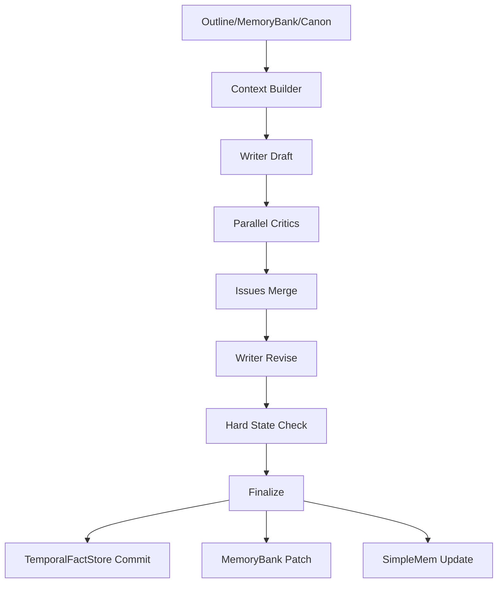

# Data Flow & Entry Points

## Pipeline Overview

## Entry Points (Functions)

- `chapter_pipeline.ChapterPipeline.run(chapter_id)`
- `story_memory_adapter.get_writing_context()`
- `story_state_manager.validate_plan()` / `story_state_manager.validate_chapter()`
- `temporal_fact_store.TemporalFactStore.get_snapshot()`
- `memory_bank_manager.MemoryBankManager.update_from_chapter()`
- `critics.critics_runner.run_critics()`
- `critics.issues_merger.merge_issues()`

## Outputs (Per Chapter)

- draft / revised / final text
- issues_raw_{provider}.json
- issues_merged.json
- state_diff.json
- memory_patch_proposal.json / memory_patch_applied.json
- memory_commits/Chapter_{id}_{hash}.json
